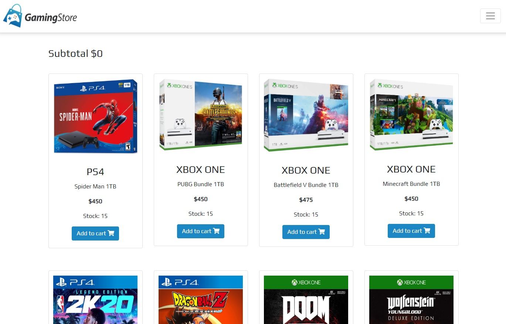

## GameStore App

*  [Setup](#setup)

*  [General info](#general-info)

*  [Technologies](#technologies)

  

## Setup

To run this project, install it locally using npm:

  

```

$ cd ../project_folder

$ npm install

$ npm start

```

## General info

  

This app allows you to add and remove a products from the store to the cart and make the purchase:

  



## Technologies

Project is created with:

* ReactJS

* Reactstrap
* Redux